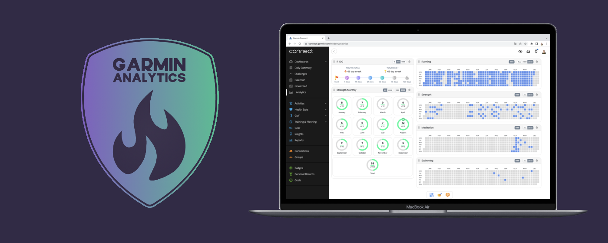

# Garmin Analytics chrome extension

An addition to your Garmin Connect platform that allows you to have a dashboard with multiple widgets based on your activity data!

Store: https://chrome.google.com/webstore/detail/garmin-analytics/eldndomlleheiajlfhijbljgbklcpfji  
Overview: https://medium.com/@volodymyr.budnyi/overview-of-garmin-analytics-extension-for-google-chrome-489917e01ac5



# Version History

**1.0.2 - Initial public version**

# Publish

To create a new release build and archive it for publishing, follow these steps:

- **Build:** Run the production build:

  ```bash
  npm run build
  ```

- **Copy build to release folder:** Create a release folder and copy the contents of the `dist` build into it (replace `x.x` with the release version):

  ```bash
  mkdir -p releases/garmin-analytics-x.x
  cp -R dist/* releases/garmin-analytics-x.x/
  ```

  Note: this repository stores packaged releases under the `releases/` directory (for example `releases/garmin-analytics-1.0.4/`).

- **Archive the folder:** Create a compressed archive of the release folder
